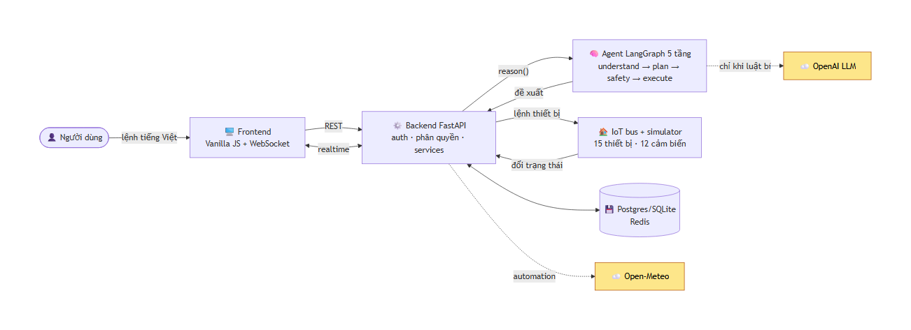

# 🏠 VinButler — Trợ lý nhà thông minh tiếng Việt

Agent hiểu lệnh tiếng Việt tự nhiên, tự lập kế hoạch đa bước và điều khiển thiết bị trong nhà — có xác nhận người dùng cho lệnh nhạy cảm, phát hiện lệnh mâu thuẫn, và học thói quen từng thành viên.

> Dự án VinUni AI20K Build Phase — Nhóm G10 / T021 (lớp C401)
>
> 🌐 **Live demo:** **https://smarthome-agent.onrender.com** · [API docs](https://smarthome-agent.onrender.com/docs) · [Health](https://smarthome-agent.onrender.com/health) — đăng nhập `bo` / `demo1234`
>
> 🐳 **Docker image:** `docker.io/nvdai1804/smarthome-backend:3.0`
> 📖 [Sơ đồ kiến trúc](docs/architecture.md)
> 📦 Deliverables: [Nhật ký](docs/journal.md) · [Worklog](docs/worklog.md) · [Đánh giá](docs/evaluation.md) · [Video demo](docs/video-demo.md) · [Pitch deck](docs/pitch-deck.md)

## Nhóm thực hiện

| Thành viên                          | MSSV        | Vai trò trong dự án                                    | Chuyên môn                                                                                      |
| ----------------------------------- | ----------- | ------------------------------------------------------ | ----------------------------------------------------------------------------------------------- |
| **Nguyễn Trọng Dũng** (Trưởng nhóm) | 2A202601965 | PM, Frontend, tích hợp hệ thống (FE,BE,AI), Evaluation | UI/UX Design, Frontend, Backend, Data Engineering, Machine Learning, NLP, Communication         |
| **Nguyễn Văn Đại**                  | 2A202601217 | Backend, Database, DevOps/Cloud, IoT simulator         | Data Engineering, DevOps/Cloud, Data Analysis, Computer Vision, Machine Learning, Communication |
| **Hoàng Văn Phái**                  | 2A202601575 | AI Agent core, NLU, Pipeline multi-agent               | Machine Learning, NLP, Computer Vision                                                          |
| **Đỗ Tuấn Sơn**                     | 2A202601051 | PM giai đoạn đầu, Trải nghiệm người dùng               | Project Management, Tester                                                                      |

## Vấn đề

Cư dân chung cư có rất nhiều thiết bị thông minh, nhưng mỗi hãng một app riêng — rời rạc, khó đồng bộ, và không app nào hiểu được ngữ cảnh sinh hoạt của cả gia đình. Muốn "chuẩn bị phòng khách đón khách" phải mở bốn app và bấm mười lần.

## Giải pháp

Một agent duy nhất, nói chuyện bằng tiếng Việt:

```
Bạn:   tối nay có khách, chuẩn bị phòng khách
Agent: 🔐 Thiết bị công suất lớn nên cần xác nhận.
       Kế hoạch «Đón khách»:
       1. đặt độ sáng Đèn phòng khách 90% — Bật sáng phòng khách đón khách
       🔐 2. đặt nhiệt độ Điều hoà phòng khách 25°C — Làm mát trước khi khách tới
       3. bật Máy lọc không khí — Lọc không khí cho phòng khách
       4. mở Rèm cửa phòng khách — Mở rèm cho phòng khách thoáng
       5. bật Loa thông minh — Bật nhạc nền tiếp khách

[Bạn bấm Đồng ý]

Agent: ✅ Đặt độ sáng Đèn phòng khách = 90%.
       ✅ Đặt nhiệt độ Điều hoà phòng khách = 25°C.
       ✅ Đã bật Máy lọc không khí.
       ✅ Đã bật Loa thông minh.
       ↔️ Giữ nguyên (đã đúng trạng thái): Rèm cửa phòng khách
       ⚠️ Điều hoà đang được đặt 25°C, nhưng Nguyễn Thị Mẹ thích 24°C.
          → Bạn có muốn đặt mức trung hoà 24°C không?
```

## Tính năng

|     | Tính năng                            | Ghi chú                                                            |
| --- | ------------------------------------ | ------------------------------------------------------------------ |
| ✅  | Đăng nhập 2 vai trò                  | Chủ hộ và thành viên, phân quyền theo cả độ tuổi                   |
| ✅  | Dashboard 15 thiết bị + 12 cảm biến  | Điều khiển trực tiếp, cập nhật realtime qua WebSocket              |
| ✅  | Hiểu tiếng Việt tự nhiên             | Có dấu lẫn không dấu (`bat den phong khach` cũng hiểu)             |
| ✅  | Lập kế hoạch đa bước                 | 6 kịch bản: đón khách, đi ngủ, dọn nhà, ra ngoài, về nhà, xem phim |
| ✅  | Human-in-the-loop                    | Lệnh an ninh và thiết bị công suất lớn phải được xác nhận          |
| ✅  | Phát hiện lệnh mâu thuẫn             | 4 nhóm: sở thích, lãng phí điện, tự mâu thuẫn, an toàn             |
| ✅  | Hỏi lại khi lệnh mơ hồ               | "tắt đèn" → "Bạn muốn tắt đèn phòng nào ạ?"                        |
| ✅  | Học thói quen                        | Từ lịch sử hành động, có độ tin cậy, cho phép hoãn giờ             |
| ✅  | Automation môi trường realtime       | Open-Meteo: nhiệt độ, mưa, gió, UV, PM2.5 và AQI                   |
| ✅  | Log lịch sử hành động                | Ai làm gì, lúc nào, kết quả ra sao, mất bao lâu                    |
| ✅  | Mã hoá dữ liệu cá nhân               | Mỗi hộ một khoá riêng                                              |
| ✅  | Độ trễ < 2s                          | Đo thực tế: p50 **4ms**, p95 **30ms**                              |
| ✅  | Chạy được khi mất mạng/hết quota LLM | NLU rule-based tiếng Việt làm lớp dự phòng                         |

## Công nghệ

| Thành phần      | Công nghệ                                                                                             |
| --------------- | ----------------------------------------------------------------------------------------------------- |
| Điều phối agent | **LangGraph** — plan → act → verify, HITL bằng `interrupt()`                                          |
| Backend         | **FastAPI** + Pydantic + SQLAlchemy                                                                   |
| LLM             | **OpenAI** (mặc định `gpt-5-nano`, cấu hình bằng `MODEL_NAME`), có fallback NLU rule-based tiếng Việt |
| IoT hub         | **MQTT / Mosquitto** (mô phỏng thiết bị), fallback bus in-process                                     |
| Bộ nhớ          | **Redis** cho phiên, **Postgres** cho thói quen dài hạn (fallback SQLite + in-process)                |
| Frontend        | **HTML5 + CSS3 + Vanilla JS**, WebSocket realtime, dark mode, responsive, phong cách Home Assistant   |
| Triển khai      | **Docker Compose** — backend, postgres, redis, mosquitto                                              |

## Kiến trúc



Chi tiết pipeline 5 tầng, luồng HITL và bảng ánh xạ component → mã nguồn: **[docs/architecture.md](docs/architecture.md)**.

## Chạy thử

Không cần Docker, Postgres, Redis hay Mosquitto — bản mặc định chạy được ngay.

### Khởi động hệ thống

```bash
python3.11 -m venv .venv && source .venv/bin/activate
pip install -r requirements.txt
cp .env.example .env
uvicorn src.main:app --reload --port 8000
```

- **Giao diện web (Frontend):** Mở http://localhost:8000 (tự động load giao diện từ thư mục `frontend/`)
- **API Docs (Swagger UI):** Mở http://localhost:8000/docs
- Database và dữ liệu mẫu được tạo tự động khi khởi động.

### Tài khoản demo

Mật khẩu chung: `demo1234`

| Tài khoản | Vai trò    | Tuổi | Minh hoạ                                |
| --------- | ---------- | ---- | --------------------------------------- |
| `bo`      | Chủ hộ     | 45   | Mọi quyền, lệnh an ninh cần xác nhận    |
| `me`      | Thành viên | 42   | Bị chặn lệnh an ninh                    |
| `con_lon` | Thành viên | 15   | Thiết bị công suất lớn cần chủ hộ duyệt |
| `con_nho` | Thành viên | 8    | Bị từ chối thiết bị công suất lớn       |

### Chạy với hạ tầng thật

```bash
docker compose up --build
```

Backend tự chuyển sang Postgres + Redis + Mosquitto qua biến môi trường, không phải sửa code.

## Kịch bản demo

1. Đăng nhập `bo` → dashboard hiện 15 thiết bị, badge **Realtime** xanh
2. Gõ `tối nay có khách, chuẩn bị phòng khách` → agent lập kế hoạch 5 bước, dừng lại xin xác nhận điều hoà
3. Bấm **Đồng ý** → thiết bị đổi trạng thái ngay trên dashboard, kèm cảnh báo xung đột sở thích
4. Gõ `tắt đèn` → agent hỏi lại phòng nào; trả lời `phòng khách` → agent hiểu và thực hiện
5. Đăng nhập `con_nho` → gõ `bật bình nóng lạnh` → bị từ chối đúng luật
6. Đăng nhập `bo` → gõ `mở cửa chính` → modal HITL; bấm **Từ chối** → cửa vẫn khoá
7. Tab **Lịch sử** → toàn bộ hành động kèm nguồn, người thực hiện, độ trễ

## Kiểm thử

```bash
pytest tests/ -v          # 127 test
ruff check src/ tests/    # lint
python -m eval.measure_latency   # đo độ trễ p50/p95/p99
```

Test chạy hoàn toàn offline (`LLM_DISABLED=true`), mỗi case một database riêng.

## Cấu hình

Xem [.env.example](.env.example). Các biến đáng chú ý:

| Biến                                            | Mặc định | Tác dụng                                                          |
| ----------------------------------------------- | -------- | ----------------------------------------------------------------- |
| `LLM_DISABLED`                                  | `false`  | `true` = chạy hoàn toàn bằng NLU rule-based, không gọi mạng       |
| `MQTT_ENABLED`                                  | `false`  | `true` = nối Mosquitto thật thay vì bus in-process                |
| `DATABASE_URL`                                  | SQLite   | Đổi sang `postgresql+psycopg://…` để dùng Postgres                |
| `REDIS_URL`                                     | rỗng     | Điền để chuyển bộ nhớ phiên sang Redis                            |
| `PM25_THRESHOLD`                                | `55`     | Ngưỡng bụi để agent đề xuất đóng cửa sổ                           |
| `AWAY_MINUTES_THRESHOLD`                        | `120`    | Vắng nhà bao lâu thì cảnh báo lãng phí điện                       |
| `ENVIRONMENT_REALTIME_ENABLED`                  | `true`   | Đồng bộ weather/AQI từ Open-Meteo vào sensor của agent            |
| `ENVIRONMENT_AUTO_EXECUTE`                      | `true`   | Tự chạy duy nhất các hành động môi trường trong allowlist an toàn |
| `ENVIRONMENT_LATITUDE`, `ENVIRONMENT_LONGITUDE` | Hà Nội   | Tọa độ ngôi nhà dùng để lấy dữ liệu realtime                      |

Automation realtime cache dữ liệu 5 phút. Mưa hoặc gió mạnh sẽ đóng cửa sổ; PM2.5/AQI
xấu sẽ đóng cửa sổ và bật máy lọc; nóng + nắng gắt hoặc UV cao sẽ kéo rèm. Các lệnh
an ninh, thiết bị công suất cao, thói quen và chế độ vắng nhà không được tự chạy qua
nhánh này. Mọi hành động tự động đều xuất hiện trong lịch sử với nguồn `automation`.

## Hướng phát triển (phần nâng cao)

Kiến trúc đã chuẩn bị sẵn cho phần offline hoàn toàn:

- `src/services/llm.py` trả `None` khi không gọi được LLM → chỉ cần thay bằng SLM lượng tử hoá (qwen2.5-3B / llama.cpp) là chạy offline
- `DeviceBus` đã tách interface → cắm Raspberry Pi / Jetson hub giả lập không phải sửa agent
- Còn thiếu: Speech-to-text tiếng Việt (Whisper.cpp/PhoWhisper), Text-to-Speech (Piper), RAG hướng dẫn thiết bị
