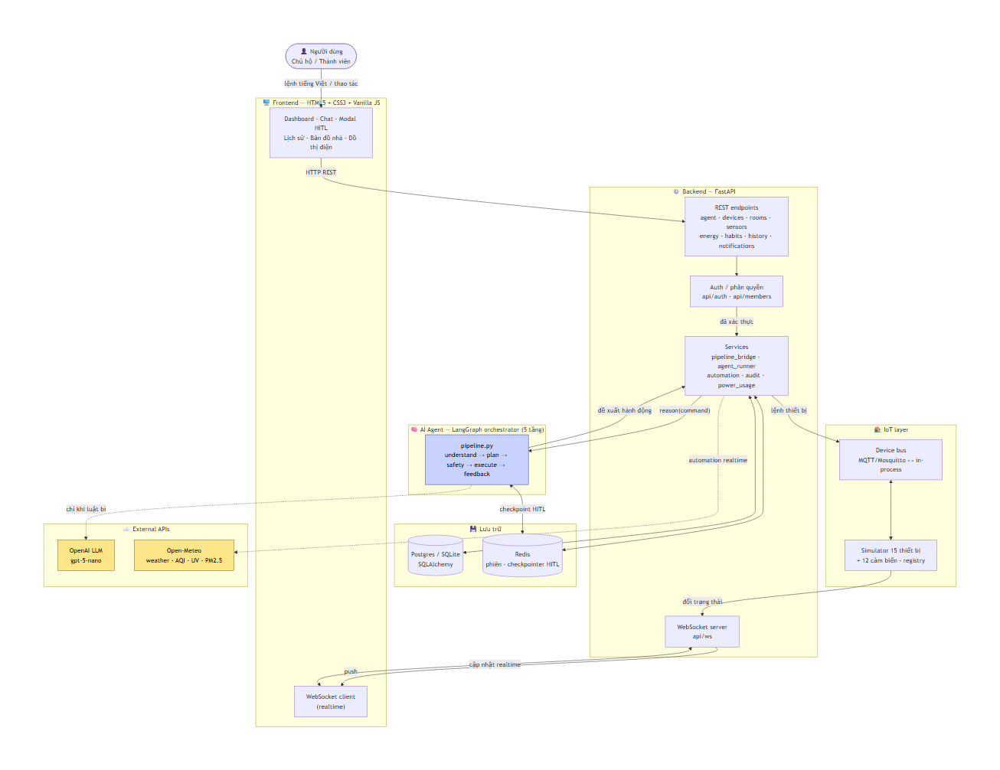
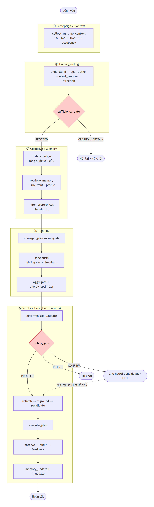
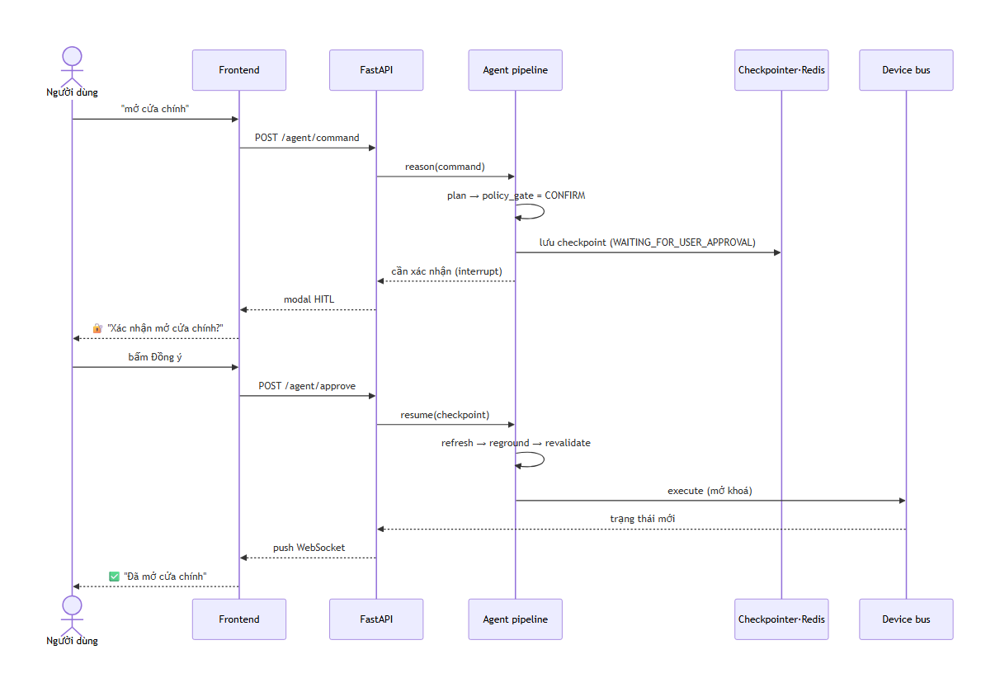

# Sơ đồ kiến trúc — VinButler

> Sơ đồ xuất ra **ảnh PNG** (trong `docs/diagrams/`) để hiển thị tức thì trên mọi nền tảng; nguồn Mermaid dựng ảnh nằm trong lịch sử git.
> Nguồn: phân tích trực tiếp `src/` — pipeline 5 tầng `src/agent/pipeline.py` (spec §56).

## Checklist Architecture Diagram (BTC)

- [x] Sơ đồ rõ ràng, dễ đọc — 3 sơ đồ: tổng quan hệ thống, pipeline agent 5 tầng, luồng HITL.
- [x] Đầy đủ components — Frontend, Backend API, Agent (LangGraph), DB/Cache, External APIs, IoT bus.
- [x] Có data flow arrows — mũi tên có nhãn thể hiện luồng dữ liệu/điều khiển.
- [x] Format PNG embed trong README/docs — hiển thị được trên mọi trình xem markdown.
- [x] Có mô tả ngắn kèm sơ đồ — mỗi sơ đồ có phần giải thích bên dưới.

---

## 1. Kiến trúc tổng quan hệ thống

**Giải thích:** Frontend gọi Backend qua REST cho hành động và nhận cập nhật realtime qua WebSocket. Backend xác thực → phân quyền → chuyển lệnh vào Agent qua `pipeline_bridge`. Agent chỉ **đề xuất**; Backend/harness mới thực thi qua Device bus. Trạng thái thiết bị đổi được đẩy ngược về FE qua WebSocket. LLM và Open-Meteo là dịch vụ ngoài, gọi **có điều kiện** (đường nét đứt) — hệ thống vẫn chạy khi mất mạng nhờ NLU rule-based và bus in-process.

---

## 2. Pipeline Agent 5 tầng (LangGraph, spec §56)

**Giải thích:** Đây là đường suy luận **production duy nhất**. Bất biến an toàn được cài ở từng node: understanding không thực thi; planner chỉ ground qua specialists; memory không đè trạng thái live; RL không đụng safety; LLM không gọi device API. Điểm mấu chốt là **trust boundary** trước mọi dispatch — kể cả khi resume sau phê duyệt HITL, vẫn chạy lại `refresh → reground → revalidate → execute`.

---

## 3. Luồng Human-in-the-loop (HITL)

**Giải thích:** Lệnh nhạy cảm (an ninh, thiết bị công suất lớn) dừng ở `policy_gate = CONFIRM`, lưu checkpoint bằng LangGraph `interrupt()` để **sống sót qua restart**. Khi người dùng Đồng ý, pipeline resume nhưng **không tin kế hoạch cũ** — làm tươi và kiểm tra lại toàn bộ trước khi thực thi.

---

## Bảng ánh xạ component → mã nguồn

| Thành phần | Vị trí | Ghi chú |
|---|---|---|
| Frontend | `frontend/` | HTML5 + Vanilla JS, WebSocket realtime |
| REST API | `src/api/` | auth, agent, devices, rooms, sensors, energy, habits, history, notifications, members |
| WebSocket | `src/api/ws.py` | đẩy đổi trạng thái realtime |
| Services / bridge | `src/services/` | `pipeline_bridge`, `agent_runner`, `automation`, `audit`, `power_usage` |
| Agent orchestrator | `src/agent/pipeline.py` | LangGraph 5 tầng |
| Understanding / NLU | `src/nlu/`, `src/agent/understanding/` | goal_author, context_resolver, direction |
| Cognitive / Memory | `src/agent/cognitive/`, `src/agent/memory/` | ledger, Turn/Event store, profile |
| Planning | `src/agent/planning/`, `src/agent/specialists/` | manager, aggregator, energy_optimizer |
| Safety / Execution | `src/agent/harness/` | validator, policy, refresh, executor, audit |
| Preference / RL | `src/agent/preference/` | bandit, reward |
| IoT | `src/iot/` | bus (mqtt/in-process), simulator, registry |
| Database | `src/db/`, `src/models/` | SQLAlchemy, migrate, seed, checkpointer |
| External LLM | `src/services/` + `src/nlu/model_client.py` | OpenAI, fallback rule-based |
| External weather | `src/services/automation.py` | Open-Meteo |
